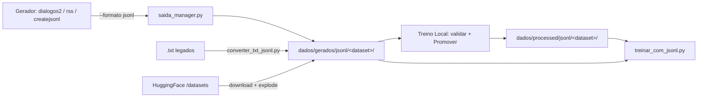

# 📦 Pipeline JSONL do RigelSLM — Separação TXT/JSONL + Parâmetros de Treino

> Data: 02/08/2026 · Versão: 1.0.0
> Princípio: **nunca misturar TXT com JSONL**. Cada formato tem sua área e seu treinador.

---

## 🗂️ Onde fica cada coisa (regra de ouro)

| Área | Formato | Treinador | Como entra |
|------|---------|-----------|------------|
| `dados/gerados/<categoria>/` (curtos, longos, Artigo, Conversa...) | **TXT** (legado/gerado) | `treino.py` / `treinov2.py` (causal) | `dialogos2.py` (txt), `rss_processor.py` (txt), geração local |
| `dados/gerados/jsonl/<dataset>/` | **JSONL SFT** (messages) | `treinar_com_jsonl.py` | Geradores com `--formato jsonl`, `converter_txt_jsonl.py`, downloads HF (`/datasets`) |
| `dados/processed/jsonl/<dataset>/` | **JSONL SFT** (validado/promovido) | `treinar_com_jsonl.py` | Botão **"✅ Promover p/ processed"** no Treino Local (valida + copia só os válidos) |
| `dados/processed/<categoria>/` | **TXT** (qualificado p/ treino causal) | `treino.py` | `preparar_dados.py --qualificar` |

**NUNCA**: um `.txt` dentro de `*/jsonl/*` nem um `.jsonl` dentro de uma pasta de categoria TXT.
(Validado em 02/08: 0 TXT dentro das pastas jsonl, 0 JSONL nas pastas TXT.)

---

## 🔄 Fluxo completo (JSONL SFT — o caminho novo)



1. **Gerar**: `dialogos2.py --tipo <tipo> --quantidade N --formato jsonl --pasta-jsonl <nome>` ou pelo dashboard (**Gerar Local → Diálogos v2 → 📦 JSONL**). Saída: `dados/gerados/jsonl/<nome>/`.
2. **Converter legado**: `python converter_txt_jsonl.py --pasta dados/processed/<pasta_txt> --saida <nome> [--apenas-qna] [--max-arquivos N]` → `dados/gerados/jsonl/<nome>/`.
3. **Validar**: no Treino Local, selecione o dataset e clique **"✅ Promover p/ processed"** — valida cada arquivo (JSON válido, formato `messages`, ≥2 mensagens), copia **só os válidos** para `dados/processed/jsonl/<nome>/` e opcionalmente remove inválidos da origem.
4. **Treinar**: `python treinar_com_jsonl.py --dados dados/gerados/jsonl/<nome>` (trabalho) ou `--dados dados/processed/jsonl/<nome>` (validado). Também dá pelo dashboard (Treino Local → escolher dataset → arquivo → Treinar).

---

## 🏆 Melhores parâmetros de treino (RigelSLM 58M, SFT)

Defaults já corretos no `treinar_com_jsonl.py` (não precisa passar nada):

| Parâmetro | Valor | Por quê |
|-----------|-------|---------|
| `--lr` | **1e-4** | SFT usa LR menor que o causal (3e-4) — não estraga pesos pré-treinados |
| `--epochs` | **5** | Suficiente p/ 58M em dados limpos; mais epochs = overfit |
| `--batch-size` | **8** | Memória (CPU/GPU pequena) |
| `--accum` | **4** | Batch efetivo 32 (8×4) — estabilidade do gradiente |
| `--seq-len` | **512** | Dimensão do modelo (posição máx). Truncamento preserva a resposta |
| `--weight-decay` | **0.01** | Regularização padrão AdamW |
| `--label-smoothing` | **0.0** | SFT: desligado (quebra a máscara de loss do assistant) |
| `--val-split` | **0.1** | 10% p/ validação |
| `--early-stop-patience` | **5** | Para se não melhorar |
| `--warmup` | **10% dos steps** | Sobe LR suavemente (cosine schedule) |
| `--incluir-system` | **Sim** (default) | Modelo aprende a responder com a identidade Rigel no contexto |

**Volume recomendado (medido em 02/08):**
- 1 arquivo = 1000 exemplos ≈ **932 mil tokens** ≈ 57 min em CPU (274 tok/s)
- Para CPU: **2–5 arquivos por sessão** (`--max-arquivos N`)
- Subset diverso de **100–150k exemplos + 2–3 épocas** costuma ser melhor que 1 época em tudo
- Formato: `{"messages": [{"role":"system",...},{"role":"user",...},{"role":"assistant",...}]}` — loss **só no assistant**

**Comando exemplo (CPU, 3 arquivos):**
```powershell
python treinar_com_jsonl.py --dados dados/gerados/jsonl/<nome> --max-arquivos 3 --resume
```

---

## 📋 Campos dos exemplos (metadados completos)

Cada exemplo JSONL carrega `messages` (usado no treino) **mais metadados** de rastreio/qualidade
(ignorados pelo treinador — enriquecer não interfere no treino):

| Campo | Descrição |
|-------|-----------|
| `messages` | Obrigatório: `system`/`user`/`assistant` (loss só no assistant) |
| `_id` | Hash MD5 (16) do par pergunta\|resposta |
| `_fonte` | Origem (arquivo `.txt` relativo / dataset / gerador) |
| `_tipo` | `qna` ou `artigo` (conversor) |
| `_categoria` | Pasta de origem (ex.: canarim, PerguntaseRespostas) |
| `_assunto` | Tema derivado |
| `_idioma` | `pt-BR` |
| `_data` | Timestamp ISO da geração |
| `_nota` | Nota de qualidade (geradores com avaliação) |

Exemplo real (conversão de `.txt`):
```json
{"messages": [...], "_id": "4c86d2cf9578bf5f", "_fonte": "canarim_000000.txt",
 "_tipo": "qna", "_categoria": "canarim", "_assunto": "canarim",
 "_idioma": "pt-BR", "_data": "2026-08-03T01:05:36"}
```

---

## 🧹 Limpeza / Sanitização / Verificação (para dados TXT que viram JSONL)

1. `limpeza.py` — corrige codificação (latin-1/cp1252 → UTF-8) dos `.txt`
2. `verificador.py` / `validation.py` — detecta truncamentos, HTML/markdown, repetição excessiva, respostas genéricas, "muletas de IA"
3. `converter_txt_jsonl.py` — converte `Pergunta:/Resposta:` e artigos → JSONL SFT (corrige mojibake, dedup por MD5)
4. Treino Local → **Promover p/ processed** — validação estrutural final (só arquivos bons passam)

**Regra:** todo JSONL que passa por esse processo termina em `dados/processed/jsonl/` — **nunca** em pasta de TXT.

---

## 📌 Checklist rápido p/ um dataset novo

- [ ] JSONL criado em `dados/gerados/jsonl/<nome>/` (nunca em pasta de TXT)
- [ ] Conferir 1 exemplo: `Get-Content "dados/gerados/jsonl/<nome>/<nome>_0001.jsonl" -TotalCount 1`
- [ ] Abrir Treino Local → dataset aparece na lista
- [ ] **Promover p/ processed** (valida + copia)
- [ ] Treinar: `python treinar_com_jsonl.py --dados dados/processed/jsonl/<nome> --max-arquivos 3`
- [ ] Converter: `python converter_para_gguf.py --model modelo/modelo_melhor.pt --quant Q4_K_M`
